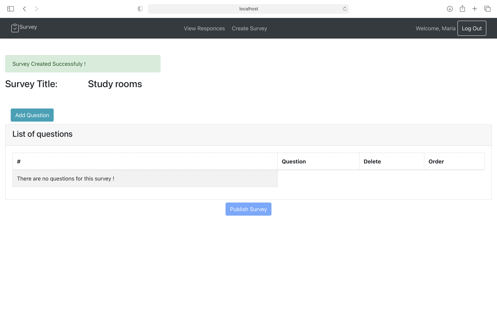
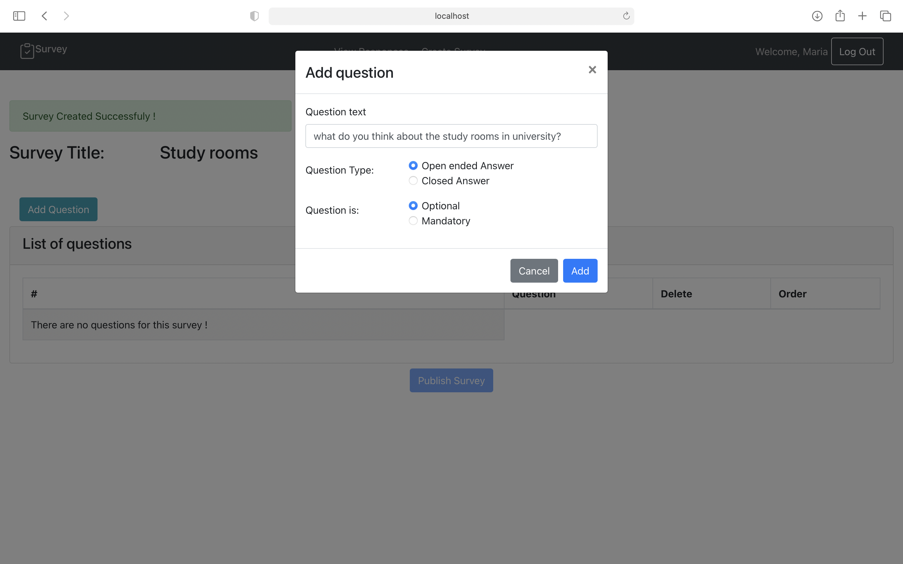
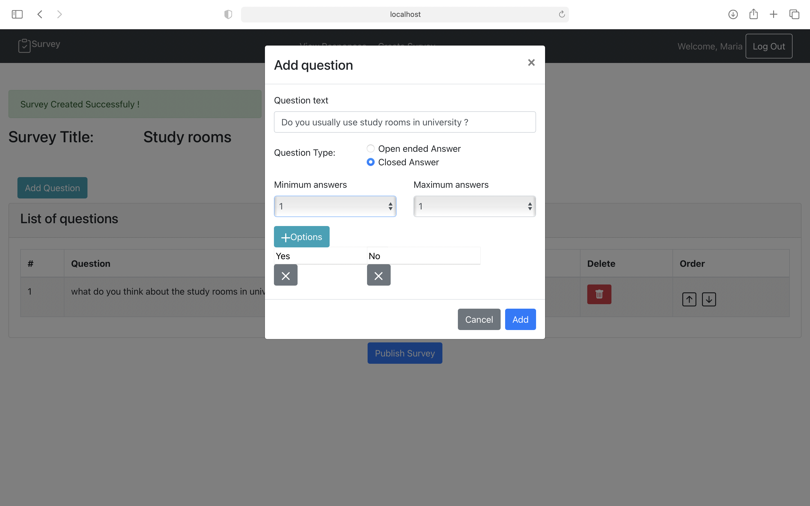
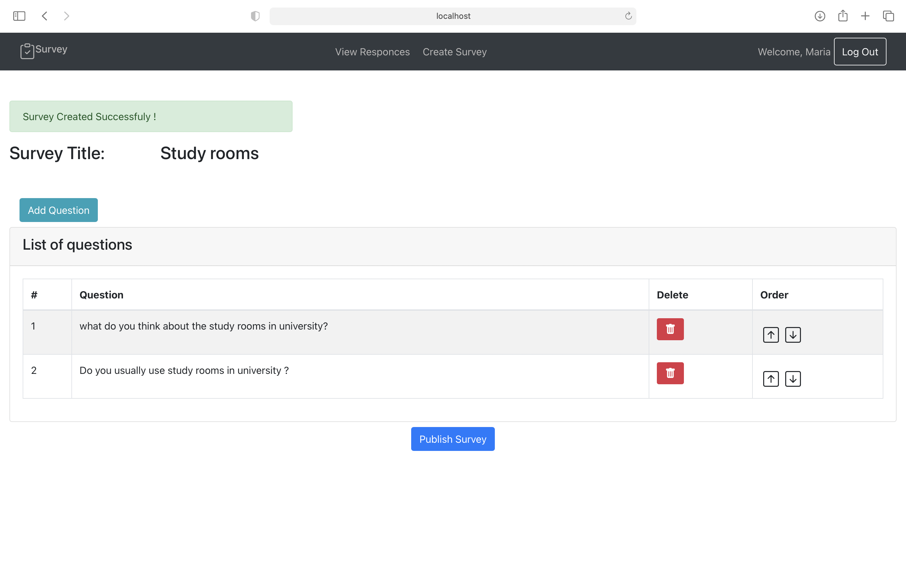

# Exam #1: "SurveyWebapp"
## Student: s274475 Feizabadi Fereshteh 

## React Client Application Routes

- Route `/`: home page, to show list of publised surveys
- Route `/login`: login form, for admin authentication
- Route `/responces`: list of surveys and number of their responces, by clicking on each survey it goes to navigation through responces. 
- Route `/userResponces/:id`: it shows the user responces for the specific survey and with next and previous button, navigate through responces, surveyId
- Route `/create`: for createing the survey, inseritng survey title, questions and deleting, removing and reordering the questions and then publishing the survey.
- Route `/survey/:id`: for showing the survey questions to the user for answering the questions and the proper validation for each question, surveyId.


## API Server

- POST `/api/sessions`
  - Description: authenticate the user who is trying to login
  - Request body: credentials of the user who is trying to login (username , password)
  - Response: 200 OK (success)
  - Response body: authenticated user 
    {
      "id": 1,
      "username": "john.doe@polito.it", 
      "name": "John"
    }

- GET  `/api/sessions/current`
  - Description: check if current user is logged in and get her data
  - Request body: None
  - Response: 200 OK (success)
  - Response body: authenticated user

    {
        "id": 1,
        "username": "john.doe@polito.it", 
        "name": "John"
    }


- DELETE `/api/sessions/current`
  - Description: logout current user
  - Request body: None
  - Response: 200 OK (success)
  - Response body: None

- GET `/api/surveys`
  - Description: to get list of all the published surveys
  - Request body: None
  - Response body: Array of objects, each describing one survey:
    ``` JSON
    [{
          "surveyId": 320,
          "title": 'Study Rooms ',
          "surveyCreator": 2,
          "isOpen": true,
          "counter": 1
    }]
    ```

- POST `/api/surveys`
  - Description: to create survey by a specific user 
  - Response body content: None
  - Request body: 

  ``` JSON
    {
          "title": 'Study Rooms ',
          "surveyCreator": 2,
    }
    ```
 

- GET `/api/users/:id/surveys`
  - Description: to get the list of surveys of a specific user 
  - Request parameters: userId
  - Request body: None
  - Response body content: 
    {
      surveyId: 319,
      title: 'Favorite Pizza',
      surveyCreator: 1,
      isOpen: true,
      counter: 1
    }

- POST `/api/question`
  - Description: adding question for the last Survey Id that is created 
  - Request body:
  { 
    Id: 259,
    surveyId: 314,
    questionTitle: 'In overall how you evaluate the dormitory ?',
    minAnswers: 1,
    maxAnswers: 1,
    orderNumber: 3,
    optionsTitle: [ [Object], [Object], [Object], [Object] ]
  }
  - Response body content: None
  - Response: 200 OK (success)

- GET `/api/survey/:id`
  - Description: get questions of the given SurveyId 
  - Request parameters: surveyId
  - Request body: None
  - Response body content: 
  {
    Id: 259,
    surveyId: 314,
    questionTitle: 'In overall how you evaluate the dormitory ?',
    minAnswers: 1,
    maxAnswers: 1,
    orderNumber: 3,
    optionsTitle: [ [Object], [Object], [Object], [Object] ]
  }

- POST `/api/answer`
  - Description: for adding answers by user
  - Response body: None
  - Request body: 
  req.body {
  surveyId: '314',
  answers: [
    { qid: 257, textarea: 'nice' },
    { qid: 260, radio: '3 days in week' },
    { qid: 259, radio: 'comfortable' },
    { qid: 262, checkedItems: [Array] },
    { qid: 261, radio: 'Kitchen is good' }
  ],
  username: 'fereshteh'
}


- GET `/api/answers/:id`
  - Description: for showing user answers for the given survey Id 
  - Request parameters: surveyId
  - Request body: None
  - Response body content: 
   {
    questionId: 276,
    userId: 21,
    username: 'Angel',
    questionTitle: 'Describe your favourite pizza?',
    answer: 'Fresh ingredients'
  }


  - GET `/api/userids/:id`
  - Description: listing the user Ids that answer the survey
  - Request parameters: surveyId
  - Request body: None
  - Response body content: 
    user IDs: [ { userId: 23 } ]


## Database Tables

- Table `users` - contains: id, email, name, hash
- Table `surveys` - contains: surveyId, title, surveyCreator, isOpen, counter
- Table `questions` - contains: Id, surveyId, questionTitle, minAnswers, maxAnswers, orderNumber, optionsTitle
- Table `answers` - contains: userId, surveyId, questionId, answer, username


## Main React Components

- `LoginForm`: (in `app.js`) for user authentication and login to access for creating survey and observing results
- `CreateSurvey`: (in `app.js`) for creating new survey and publishing it
- `QuestionForm` (in `CreateSurvey.js`): for adding new question inside the survey 
- `QuestionsList` (in `CreateSurvey.js`): for showing the list of questions and deleting, changing order of each question
- `SurveyForm` (in `app.js`): for showing the list of questions of a survey to the user for answering
- `SurveyResponces` (in `app.js`): for showing the list of surveys with the number of responces and link to survey responces
- `UserResponce` (in `app.js`): for showing the responces of a unique users for a specific survey and navigating through responces of other users 


(only _main_ components, minor ones may be skipped)

## Screenshot







## Users Credentials

- username: fc@polito.it, password: password
  - created surveys: Pre-vaccination Checklist for COVID-19 Vaccines, Study Rooms   
- username: maria@polito.it, password: ciao
  - created surveys: Dormitory Facilities, Favorite Pizza
